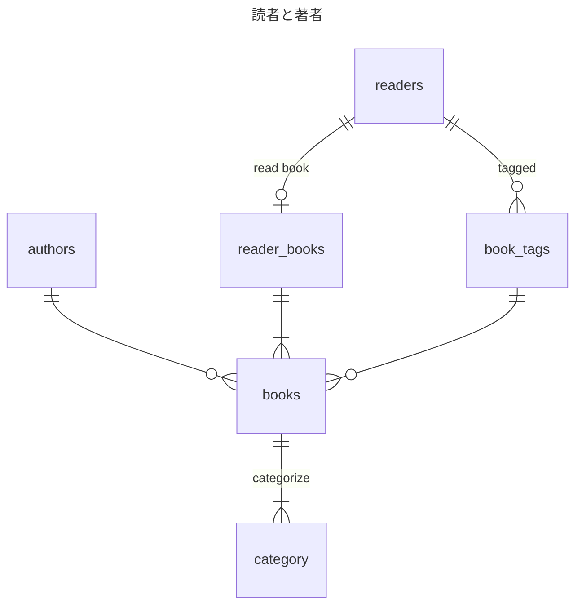

# Rails 6 to 7

Rails 6から7にあげる時に何ができるのか、できないのかをまとめる  
DBはMySQL8.0を想定している

## データ構造

```mermaid
---
title: 読者と著者
---
erDiagram
    authors ||--o{ books: ""
    readers ||--o| reader_books: "read book"
    reader_books ||--|{ books: ""
    readers ||--o{ book_tags: "tagged"
    book_tags ||--o{ books: ""
    books ||--|{ category: "categorize"
```
