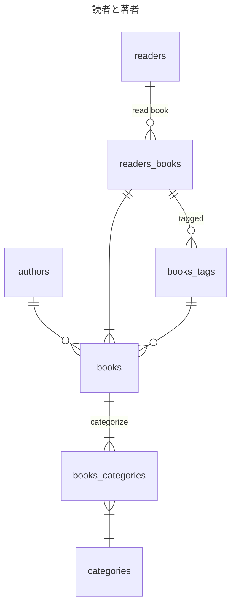

# Sandbox Rails

Rails 各バージョンでにあげる時に何ができるのか、できないのかをまとめる  
DBはMySQLを想定している

## データ構造

```mermaid
---
title: 読者と著者
---
erDiagram
    authors ||--o{ books: ""
    readers ||--o{ readers_books: "read book"
    readers_books ||--|{ books: ""
    readers_books ||--o{ books_tags: "tagged"
    books_tags ||--o{ books: ""
    books ||--|{ books_categories: "categorize"
    books_categories }|--||categories: ""
```
